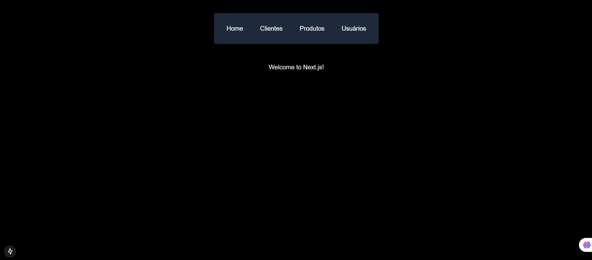
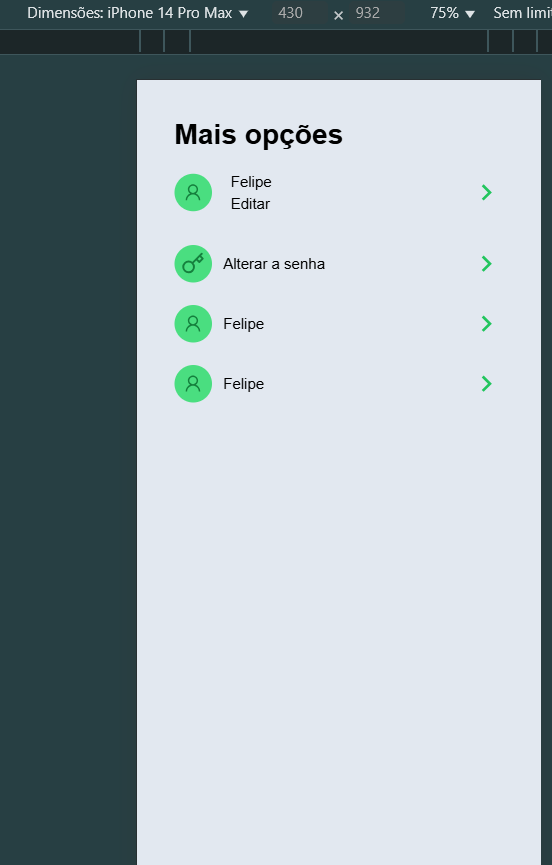

#### Paginas do projeto




#### Criando o projeto

* criando o projeto next
``` 
npx create-next-app next-mobile
```

* selecionar tudo sim

* entrar na pasta do projeto
```
 next-mobile
```

* rodar o projeto
 ```
 npm run dev
```

* instalando os icones
 ```
 npm install react-icons
 ```

 * selecionando icones
```  
 https://react-icons.github.io/react-icons/search/#q=users
```

### salvando no git pela primeira vez
```
git init
```

```
git add .gi
```

* criar o repositório no git e copiar os comandos

### atualizando no git

* git add .
* git commit -m updated
* git push